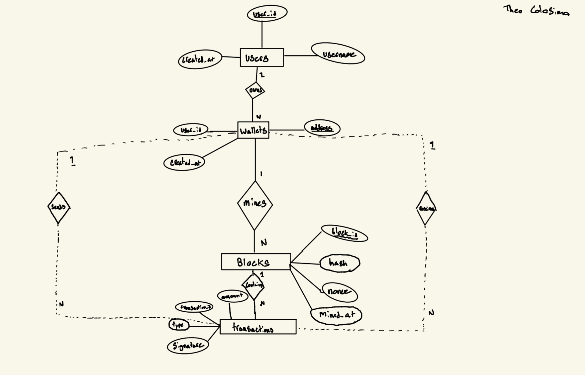
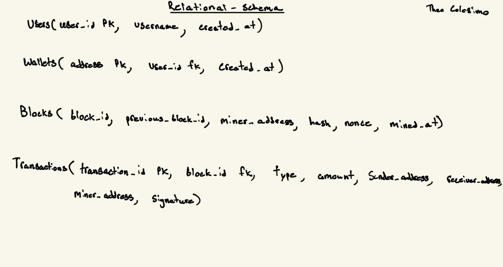

# README - CryptoSim

**CS3003/CS4092 — Programming Languages & Database Design/Development Summer 2026**
---

## Revision History

| Date       | Version | Description                          | Author |
|------------|---------|--------------------------------------|--------|
| 07/20/2026 | 0.1     | Initial README Draft             | Theo Colosimo   |
| 07/31/2026 | 0.2     | README Edits - finalized         | Theo Colosimo


---

## Overview

CryptoSim is a Java application that simulates a simplified blockchain based cryptocurrency. Users can register, create wallets, and send coins to another; transactions are cryptographically signed, collected into blocks through proof-of-work mining process, and persisted to a PostgreSQL database. The system allows anyone to view the blockchain, query balances and transaction history, and validate the integrity of the chain. 

This project simulates a single node system. It models the core data structures and validation rules of a blockchain without P2P networking or real monetary value.

---

## User Roles

- User: A registered participant who may own one or more wallets, send coins from their wallets, and query balances and history.
- Miner: Any user who chooses to mine. Mining confirms pending transactions into a new block and grants the miner a fixed coin reward ( how new coins enter the system).

Both roles interact with the system through the same command-line

---

## Functional Requirements

- **FR-1** Registration — The system should allow a new user to register with a unique username
- **FR-2** Create Wallet — The system should allow a registered user to create one or more wallets. Each wallet is assigned a cryptographic key pair, and the wallet's address should be derived from it's public key.
- **FR-3** Transactions — The system should allow a user to create a transaction sending a specific amount of coins from one of their wallets to any other wallet address. The transaction should be digitally signed with the sending wallet's private key.
- **FR-4** Transaction Validation — The system should reject a transaction if its signature is invalid or the sending wallet's balance is insufficient.
- **FR-5** Mining — The system should allow any user to mine: transactions are bundled into a new block, a proof-of-work puzzle is solved (finding a nonce such that the block hash meets the difficulty target), and the block is appended to the chain. A coinbase transaction awards a fixed 50 coins to the miner's wallet.
- **FR-6** Persistence — The system persists blocks and transactions to PostgreSQL via JDBC.
- **FR-7** View Blockchain — The system should display the blockchain, showing each block's height, hash, previous hash, miner, and contained transactions.
- **FR-8** Balance Query — The system should compute a wallet's balance as the sum of coins received minus coins sent, derived from confirmed transactions (balances are not stored).
- **FR-9** Transaction History — The system should display the transaction history for a given user across all of their wallets.
- **FR-10** Chain Validation — The system should validate the full chain on demand by recomputing each block's hash and verifying each block correctly references its predecessor, reporting any block whose stored data has been altered.

---

## Data Model

| Table       | Purpose | Notable Keys                           | 
|-------------|---------|----------------------------------------|
| Users  | Registered participants     |  user_id PK, unique username    |
| Wallets | Accounts identified by cryptographic key pair | address PK, FK to users ( user can own many wallets ) |
| Blocks | The blockchain | block_id PK, previous block hash, miner address |
| Transactions | Transfers and coinbase rewards | transaction_id PK, FK to blocks, sender/receiver/miner address | 

---

## Architecture 

[](https://editor.plantuml.com/uml/TP91JiCm44NtbNg7KVVf2H0gBKiGe21rxJYJnAhjgSOJGIGM788JSXBij5MY9Epy_pnh_ByCko2AfNKM3joTXNBZu85rOmIrj8ph5O2obZwS-JI-JbACM1pXlzy_iokDAH7GdQK3Xwv03kjLyhLL8S2pCdvGUqlwf9kvr-ykWh3ISlNVMVaGfQ4Ht9iLykBmGCONAk3Yy1YZeIHjl21NIiTWv0Fwq8OyBXQikm5_PQBgfJeIdqOc1QaP8qwiQhpaB9Mej1Ksrt7-zhG15U1nVm5I1P1bzvFqWmBAig66_j1RanmZ2NTVj_cyZ1dtJo-pz97URgV9HyzC6HOhcp2pcc1gzTYjdntwClxAFm00)

---


## ER Diagram


---

## Relational Schema


## Vide Demonstration


---


## Project Structure

```text
CryptoSim/
├── README.md
├── pom.xml
├── docs/
│   ├── er-diagram.png          # CS4092 Phase 2 — entity-relationship diagram
│   └── relational-schema.png   # CS4092 Phase 3 — relational schema
├── sql/
│   └── schema.sql              # CS4092 Phase 4 — CREATE TABLE + sample INSERTs + queries
└── src/main/java/com/cryptosim/
    ├── Main.java               # CLI menu loop
    ├── domain/
    │   ├── Blockchain.java     # Chain + validation rules
    │   ├── Block.java          # Self-hashing block container
    │   ├── Transaction.java    # Abstract base
    │   ├── TransferTransaction.java
    │   ├── CoinbaseTransaction.java
    │   ├── Wallet.java         # EC key pair + signing
    │   ├── StringUtil.java     # SHA-256 utility
    │   ├── ConsensusStrategy.java
    │   └── ProofOfWork.java    # Nonce-search mining loop
    └── storage/
        └── PostgresStorage.java  # All JDBC/SQL lives here
```
---

## Tech Stack
- Java 17
- PostgreSQL 18.3
- JDBC (org.postgresql:postgresql 42.7.3) — only external dependency
- Maven (build + dependency management)

---

## How to Run

**Prerequisites:** Java 17, Maven, PostgreSQL running with `cryptosim` database and `cryptosim_user` set up.

**Load schema:**
```
psql -U cryptosim_user -d cryptosim -f sql/schema.sql
```

**Compile and run:**
```
mvn compile
mvn exec:java "-Dexec.mainClass=com.cryptosim.Main"
```

---
